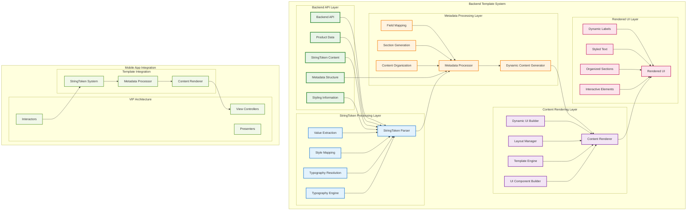
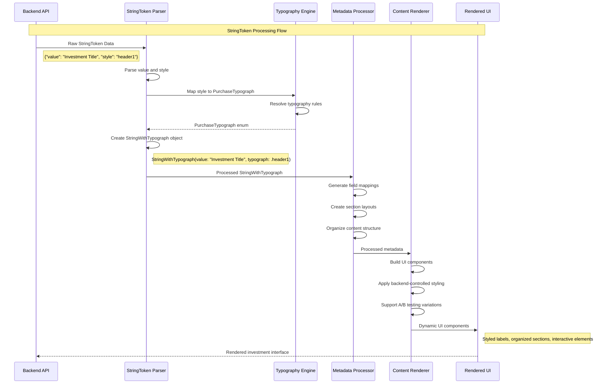
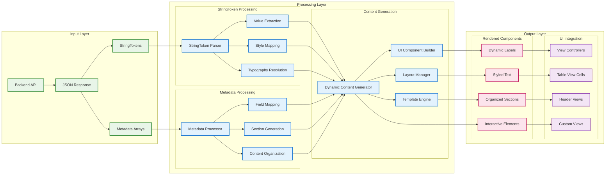
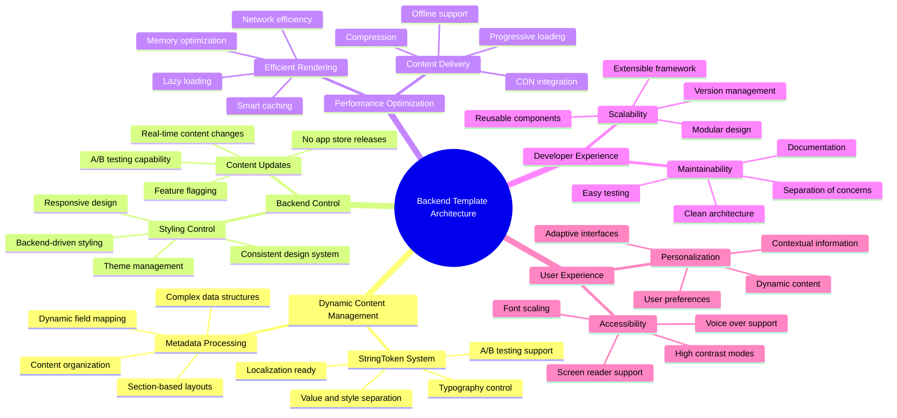
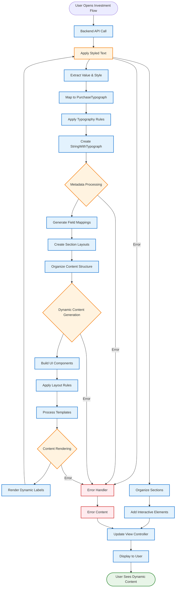
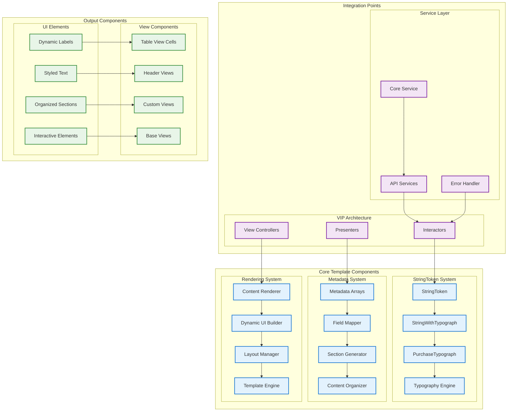
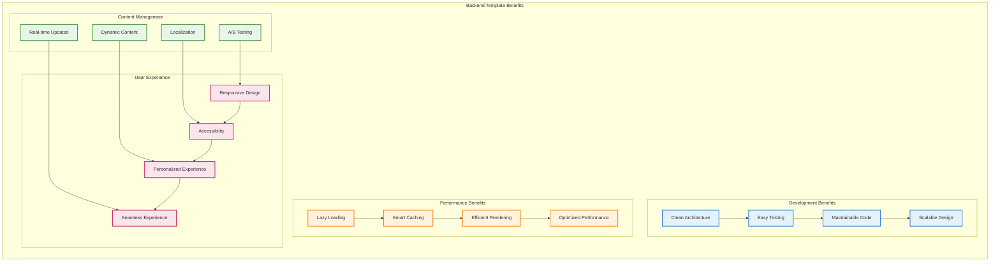

# Fabio's Backend Template Architecture - System Design (Mermaid)

## Backend Template Architecture Overview

## StringToken System Detailed Flow

## Metadata Processing Architecture

## Backend Template Benefits & Features

## Template Feature Implementation Flow

## Template System Components

## Template Feature Benefits Summary

