# Fabio's Investment Flows - Complete System Design

## Complete System Architecture Overview

```mermaid
graph TB
    subgraph "Mobile Application (iOS)"
        subgraph "Presentation Layer (VIP Architecture)"
            subgraph "View Layer"
                VC[View Controllers]
                CV[Custom Views]
                TVC[Table View Cells]
                HV[Header Views]
            end
            
            subgraph "Presenter Layer"
                P[Presenters]
                VM[View Models]
                DT[Data Transformers]
            end
            
            subgraph "Interactor Layer"
                I[Interactors]
                BL[Business Logic]
                UC[Use Cases]
            end
        end
        
        subgraph "Navigation & Coordination"
            C[Coordinators]
            DLR[Deep Link Resolvers]
            NM[Navigation Manager]
        end
        
        subgraph "Service Layer"
            AS[API Services]
            CS[Core Service]
            EH[Error Handler]
            NM2[Network Manager]
        end
        
        subgraph "Backend Template System"
            STS[StringToken System]
            MP[Metadata Processor]
            CR[Content Renderer]
            TE[Typography Engine]
        end
        
        subgraph "Infrastructure"
            DI[Dependency Injection]
            AT[Analytics & Tracking]
            SP[Security & Privacy]
            PM[Performance Monitor]
        end
    end
    
    subgraph "Backend Services"
        subgraph "API Gateway"
            AG[API Gateway]
            LB[Load Balancer]
            CDN[Content Delivery Network]
        end
        
        subgraph "Core Services"
            IS[Investment Service]
            US[User Service]
            PS[Product Service]
            OS[Order Service]
        end
        
        subgraph "Template Engine"
            TE_BE[Backend Template Engine]
            STP[StringToken Processor]
            MDP[Metadata Processor]
            CE[Content Engine]
        end
        
        subgraph "Data Layer"
            DB[(Database)]
            Cache[(Redis Cache)]
            FS[File Storage]
        end
        
        subgraph "External Integrations"
            AUTH_SVC[Authentication Service]
            PAY_SVC[Payment Service]
            NOTIF_SVC[Notification Service]
            ANALYTICS_SVC[Analytics Service]
        end
    end
    
    subgraph "External Systems"
        subgraph "Third-Party Services"
            BANK_API[Banking APIs]
            MARKET_DATA[Market Data Provider]
            REGULATORY[Regulatory Services]
        end
        
        subgraph "Infrastructure Services"
            MONITORING[Monitoring & Logging]
            SECURITY[Security Services]
            BACKUP[Backup Services]
        end
    end
    
    %% Mobile Internal Connections
    VC --> P
    P --> I
    I --> AS
    AS --> CS
    
    C --> VC
    DLR --> C
    NM --> C
    
    I --> STS
    STS --> MP
    MP --> CR
    CR --> VC
    
    DI --> VC
    DI --> I
    DI --> AS
    
    AT --> I
    SP --> I
    PM --> I
    
    %% Mobile to Backend Connections
    CS --> AG
    AG --> LB
    LB --> CDN
    
    AG --> IS
    AG --> US
    AG --> PS
    AG --> OS
    
    IS --> TE_BE
    US --> TE_BE
    PS --> TE_BE
    OS --> TE_BE
    
    TE_BE --> STP
    TE_BE --> MDP
    TE_BE --> CE
    
    IS --> DB
    US --> DB
    PS --> DB
    OS --> DB
    
    IS --> Cache
    US --> Cache
    PS --> Cache
    OS --> Cache
    
    IS --> FS
    US --> FS
    PS --> FS
    OS --> FS
    
    %% Backend to External Connections
    IS --> BANK_API
    IS --> MARKET_DATA
    IS --> REGULATORY
    
    US --> AUTH_SVC
    OS --> PAY_SVC
    IS --> NOTIF_SVC
    IS --> ANALYTICS_SVC
    
    AG --> MONITORING
    AG --> SECURITY
    DB --> BACKUP
    
    %% Styling
    classDef mobile fill:#E3F2FD,stroke:#1976D2,stroke-width:3px
    classDef backend fill:#E8F5E8,stroke:#388E3C,stroke-width:3px
    classDef external fill:#FFF3E0,stroke:#F57C00,stroke-width:3px
    classDef template fill:#F3E5F5,stroke:#7B1FA2,stroke-width:2px
    classDef infrastructure fill:#FCE4EC,stroke:#C2185B,stroke-width:2px
    
    class VC,CV,TVC,HV,P,VM,DT,I,BL,UC,C,DLR,NM,AS,CS,EH,NM2,DI,AT,SP,PM mobile
    class AG,LB,CDN,IS,US,PS,OS,DB,Cache,FS,AUTH_SVC,PAY_SVC,NOTIF_SVC,ANALYTICS_SVC backend
    class BANK_API,MARKET_DATA,REGULATORY,MONITORING,SECURITY,BACKUP external
    class STS,MP,CR,TE,TE_BE,STP,MDP,CE template
    class DI,AT,SP,PM infrastructure
```

## System Architecture Documentation

### **Mobile Application Architecture**

#### **Presentation Layer (VIP Pattern)**
- **View Layer**: Handles user interface and user interactions
- **Presenter Layer**: Transforms data for presentation and manages UI logic
- **Interactor Layer**: Contains business logic and orchestrates data flow

#### **Navigation & Coordination**
- **Coordinators**: Manage navigation flow between screens
- **Deep Link Resolvers**: Handle deep linking and URL routing
- **Navigation Manager**: Centralized navigation management

#### **Service Layer**
- **API Services**: Handle communication with backend services
- **Core Service**: Centralized service management
- **Error Handler**: Comprehensive error handling and user feedback
- **Network Manager**: Network request management and optimization

#### **Backend Template System**
- **StringToken System**: Processes backend-driven content and styling
- **Metadata Processor**: Handles complex metadata structures
- **Content Renderer**: Generates dynamic UI components
- **Typography Engine**: Manages text styling and typography

#### **Infrastructure**
- **Dependency Injection**: Manages dependencies and service location
- **Analytics & Tracking**: User behavior and performance monitoring
- **Security & Privacy**: Authentication, encryption, and privacy protection
- **Performance Monitor**: Performance tracking and optimization

### **Backend Services Architecture**

#### **API Gateway**
- **Load Balancer**: Distributes requests across multiple servers
- **Content Delivery Network**: Optimizes content delivery globally
- **Request Routing**: Routes requests to appropriate services

#### **Core Services**
- **Investment Service**: Manages investment products and transactions
- **User Service**: Handles user data and authentication
- **Product Service**: Manages product catalog and information
- **Order Service**: Processes investment orders and transactions

#### **Template Engine**
- **Backend Template Engine**: Generates dynamic content and styling
- **StringToken Processor**: Processes text and styling information
- **Metadata Processor**: Handles complex data structures
- **Content Engine**: Manages content generation and delivery

#### **Data Layer**
- **Database**: Primary data storage for all services
- **Redis Cache**: High-performance caching for frequently accessed data
- **File Storage**: Manages documents, images, and other files

#### **External Integrations**
- **Authentication Service**: User authentication and authorization
- **Payment Service**: Payment processing and financial transactions
- **Notification Service**: Push notifications and alerts
- **Analytics Service**: Data analytics and reporting

### **External Systems**

#### **Third-Party Services**
- **Banking APIs**: Integration with financial institutions
- **Market Data Provider**: Real-time market data and pricing
- **Regulatory Services**: Compliance and regulatory reporting

#### **Infrastructure Services**
- **Monitoring & Logging**: System monitoring and log management
- **Security Services**: Security monitoring and threat detection
- **Backup Services**: Data backup and disaster recovery

### **Key System Features**

#### **Backend Template Architecture**
- **Dynamic Content**: Backend controls all text, styling, and layout
- **A/B Testing**: Easy content experimentation without app updates
- **Real-time Updates**: Content changes without app store releases
- **Localization**: Multi-language support through backend configuration
- **Performance**: Optimized rendering and caching

#### **VIP Architecture**
- **Clean Separation**: Clear separation of concerns between layers
- **Testability**: Easy to test and mock components
- **Maintainability**: Easy to maintain and extend
- **Scalability**: Scales with application growth

#### **Navigation & Coordination**
- **Flexible Navigation**: Coordinator pattern for complex flows
- **Deep Linking**: Comprehensive deep linking support
- **Flow Management**: Seamless user experience across flows

#### **Security & Privacy**
- **Authentication**: Multi-factor authentication for sensitive operations
- **Data Encryption**: Secure data transmission and storage
- **Privacy Protection**: Safe mode for sensitive financial data
- **Compliance**: Regulatory compliance and data protection

#### **Performance & Monitoring**
- **Analytics**: Comprehensive user behavior tracking
- **Performance Monitoring**: Real-time performance metrics
- **Error Handling**: Robust error handling and recovery
- **Caching**: Intelligent caching for optimal performance

### **System Benefits**

#### **For Developers**
- **Clean Architecture**: Easy to understand and maintain
- **Testability**: Comprehensive testing capabilities
- **Scalability**: Easy to add new features and flows
- **Documentation**: Well-documented architecture and patterns

#### **For Business**
- **Rapid Iteration**: Quick content and feature updates
- **A/B Testing**: Easy experimentation and optimization
- **Cost Efficiency**: Reduced development and maintenance costs
- **User Experience**: Consistent and optimized user experience

#### **For Users**
- **Performance**: Fast and responsive application
- **Reliability**: Stable and error-free experience
- **Security**: Secure handling of financial data
- **Accessibility**: Accessible design for all users

This complete system design provides a comprehensive overview of Fabio's investment flows architecture, showing the macro view of mobile app, backend services, and all connections between components.
