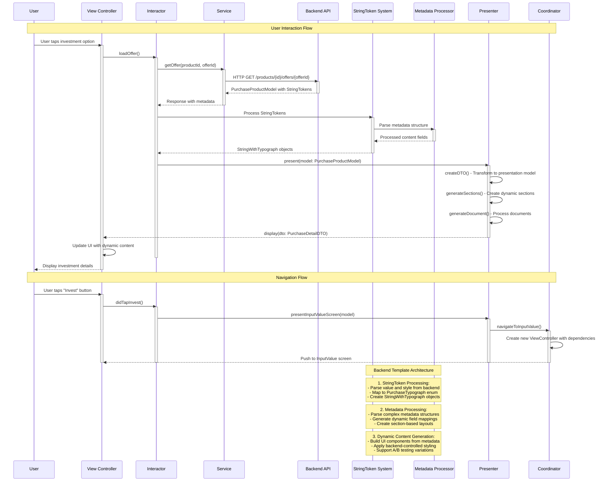
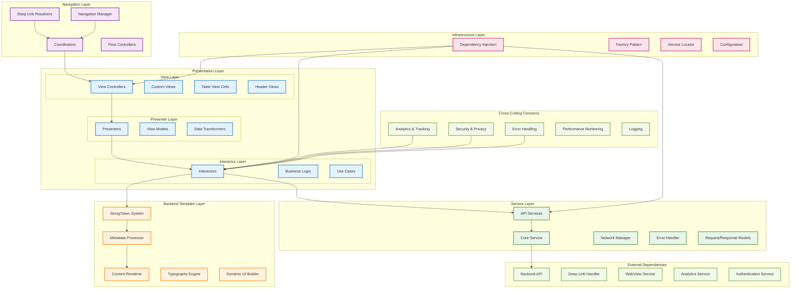
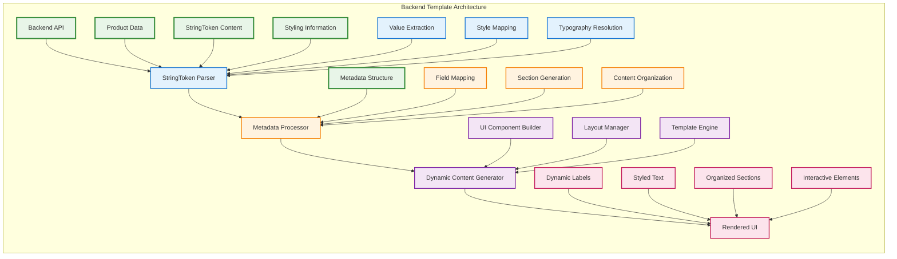
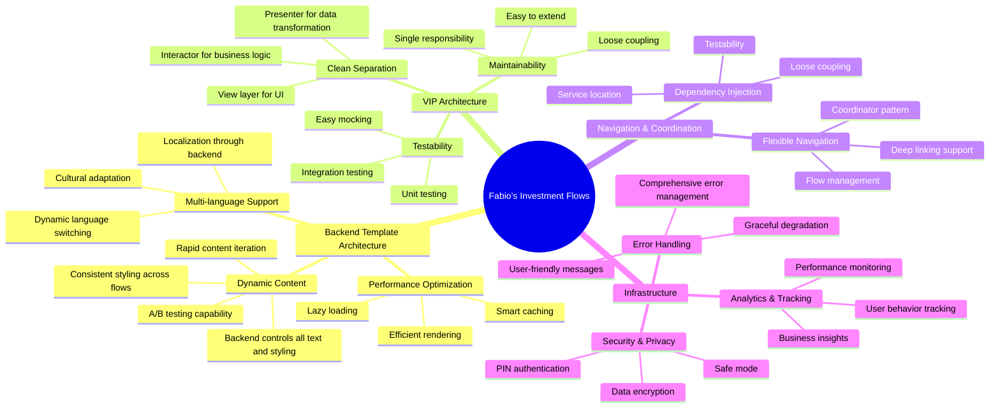

# Fabio's Investment Flows - System Design (Mermaid)

## Main System Architecture

```mermaid
graph TB
    subgraph "Investment Flows System"
        subgraph "Presentation Layer (VIP)"
            VC[View Controllers]
            P[Presenters]
            I[Interactors]
            
            PCVC[PurchaseCustodyViewController]
            PDVC[PurchaseDetailViewController]
            PLVC[PurchaseListViewController]
            OVC[OrdersViewController]
            PRVC[PurchaseResultViewController]
            
            PCP[PurchaseCustodyPresenter]
            PDP[PurchaseDetailPresenter]
            PLP[PurchaseListPresenter]
            OP[OrdersPresenter]
            PRP[PurchaseResultPresenter]
            
            PCI[PurchaseCustodyInteractor]
            PDI[PurchaseDetailInteractor]
            PLI[PurchaseListInteractor]
            OI[OrdersInteractor]
            PRI[PurchaseResultInteractor]
        end
        
        subgraph "Navigation & Coordination"
            C[Coordinators]
            DLR[Deep Link Resolvers]
            NM[Navigation Manager]
            
            PCC[PurchaseCustodyCoordinator]
            PDC[PurchaseDetailCoordinator]
            PLC[PurchaseListCoordinator]
            OC[OrdersCoordinator]
            PRC[PurchaseResultCoordinator]
            
            PCDLR[PurchaseCustodyDeeplinkResolver]
            PDDLR[PurchaseDetailDeeplinkResolver]
            PLDLR[PurchaseListDeeplinkResolver]
            ODLR[OrdersDeeplinkResolver]
            PRDLR[PurchaseResultDeeplinkResolver]
        end
        
        subgraph "Service Layer"
            AS[API Services]
            CS[Core Service]
            EH[Error Handler]
            NM2[Network Manager]
            
            PCS[PurchaseCustodyService]
            PDS[PurchaseDetailService]
            PLS[PurchaseListService]
            OS[OrdersService]
            PRS[PurchaseResultService]
        end
        
        subgraph "Backend Template Architecture"
            STS[StringToken System]
            MP[Metadata Processor]
            CR[Content Renderer]
            
            STP[StringToken Parser]
            TE[Typography Engine]
            SP[Style Processor]
            
            MP2[Metadata Parser]
            DCG[Dynamic Content Generator]
            FM[Field Mapper]
            
            DUB[Dynamic UI Builder]
            TE2[Template Engine]
            LM[Layout Manager]
        end
        
        subgraph "Infrastructure"
            DI[Dependency Injection]
            AT[Analytics & Tracking]
            SP2[Security & Privacy]
            
            DC[DependencyContainer]
            FP[Factory Pattern]
            SL[Service Locator]
            
            ET[Event Tracker]
            UA[User Analytics]
            PM[Performance Monitor]
            
            AUTH[Authentication]
            PV[PIN Validation]
            SM[Safe Mode]
            DE[Data Encryption]
        end
    end
    
    subgraph "External Systems"
        API[Backend API]
        IA[Investment API]
        UD[User Data]
        PC[Product Catalog]
        OM[Order Management]
        
        ES[External Services]
        DLH[Deep Link Handler]
        WVS[WebView Service]
        AS2[Analytics Service]
    end
    
    %% Data Flow Connections
    VC --> P
    P --> I
    I --> AS
    AS --> CS
    CS --> API
    
    %% Navigation Flow
    C --> VC
    DLR --> C
    NM --> C
    
    %% Backend Template Flow
    I --> STS
    STS --> MP
    MP --> CR
    CR --> VC
    
    %% Infrastructure Flow
    DI --> VC
    DI --> I
    DI --> AS
    
    AT --> I
    SP2 --> I
    
    %% External Connections
    CS --> IA
    CS --> UD
    CS --> PC
    CS --> OM
    
    DLH --> DLR
    WVS --> C
    AS2 --> AT
    
    %% Styling
    classDef presentation fill:#E3F2FD,stroke:#1976D2,stroke-width:2px
    classDef navigation fill:#F3E5F5,stroke:#7B1FA2,stroke-width:2px
    classDef service fill:#E8F5E8,stroke:#388E3C,stroke-width:2px
    classDef backend fill:#FFF3E0,stroke:#F57C00,stroke-width:2px
    classDef infrastructure fill:#FCE4EC,stroke:#C2185B,stroke-width:2px
    classDef external fill:#F1F8E9,stroke:#689F38,stroke-width:2px
    
    class VC,P,I,PCVC,PDVC,PLVC,OVC,PRVC,PCP,PDP,PLP,OP,PRP,PCI,PDI,PLI,OI,PRI presentation
    class C,DLR,NM,PCC,PDC,PLC,OC,PRC,PCDLR,PDDLR,PLDLR,ODLR,PRDLR navigation
    class AS,CS,EH,NM2,PCS,PDS,PLS,OS,PRS service
    class STS,MP,CR,STP,TE,SP,MP2,DCG,FM,DUB,TE2,LM backend
    class DI,AT,SP2,DC,FP,SL,ET,UA,PM,AUTH,PV,SM,DE infrastructure
    class API,IA,UD,PC,OM,ES,DLH,WVS,AS2 external
```

## Component Interaction Flow

## Architecture Layers

## Backend Template Data Flow

## System Benefits Summary

